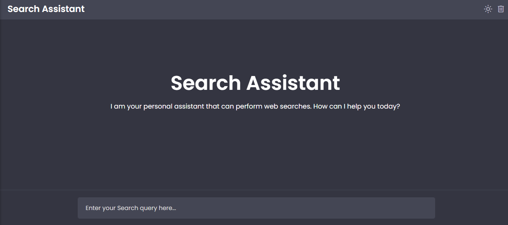
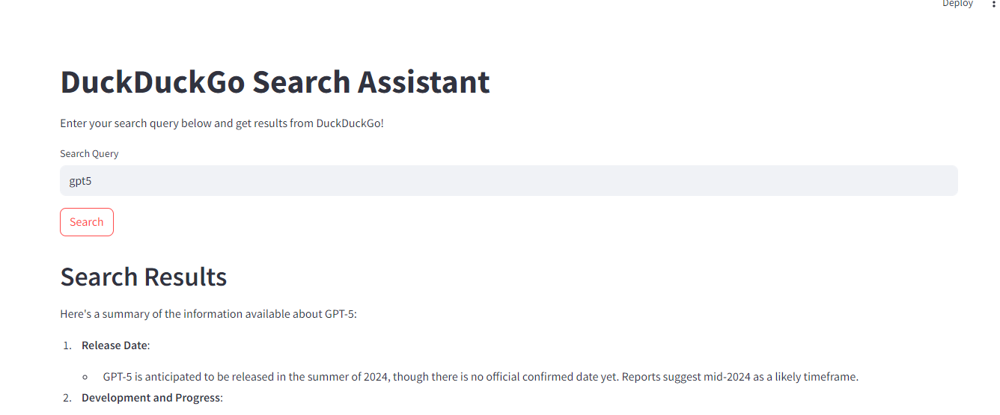

# DUCK DUCK GO Search Assistant

DuckDuckGo search assistant using Streamlit and OpenAI's API. The assistant allows users to input a search query, fetch results from DuckDuckGo, and display them in a user-friendly interface scrape the url.

## Web UI



## Streamlit UI



## Prerequisites

Before starting, ensure you have the following installed:

- Python 3.6 or higher
- Streamlit
- OpenAI Python Client
- DuckDuckGo Search Python Client
- Python Dotenv


## Installation

Clone the repository

```
git clone https://github.com/RaheesAhmed/Duck-Duck-Go-Assistant.git
```


```
cd Duck-Duck-Go-Assistant
```
Create and activate a virtual environment:
```
python -m venv venv
```

`source venv/bin/activate`   # On Windows, use `venv\Scripts\activate`


Install the required packages:
```
pip install streamlit openai duckduckgo-search python-dotenv langchain langchain-openai beautifulsoup4 langchain_community html2text
```

after installing above install playwright package:
```
playwright install
```

Create a .env file in the project root and add your OpenAI API key and Assistant ID:

```
OPEN_API_KEY=your_openai_api_key
OPENAI_ASSISTANT_ID=your_assistant_id
```
## Usage
use the streamlit you can run the `streamlit run streamlit_ui.py`

or Run the `main.py` to use the Assistant with web UI


## Project Structure
Your project directory should have the following structure:
```
duckduckgo-search-assistant/
│
├── chat_with_assistant.py
├── duck_duck_go.py
├── main.py
├── scrape_url.py
├── .env
└── README.md
```

## Code
`duck_duck_go.py`
This script contains functions to search text and images using DuckDuckGo.

`chat_with_assistant.py`
This script handles interaction with the OpenAI assistant.

`streamlit_ui.py`
This is the main Streamlit application script.

`scrape_url`
This will scrape the website on given URL.
